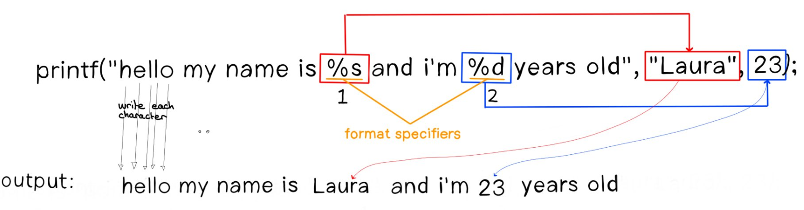

# ft_printf-42

###

<diva lign="center">
<h1>The goal of this project is simple: replicate the printf function</h1>
	

		The goal of this project is simple: replicate the printf function.
		In a nutshell, the printf function is a command to display a formatted string on the screen.
	

	
	</img>
		<h3>Custom Variadic Functions</h3>
	

		Creating custom variadic functions in C requires the use of four macros:
		<i>
			va_list, va_start, va_arg, and va_end.
		</i>
	

